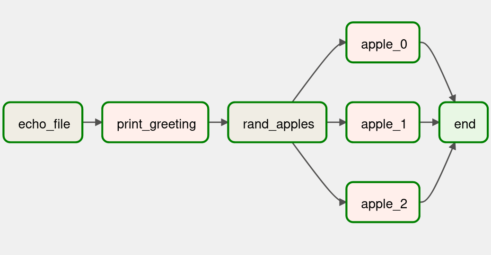

# _airflow-review_

#### By _**Alejandro Socarras**_

#### _Unit 3, Chapter 11 Code Review_

## Description

Writing and running a basic DAG in an Airflow Docker container.

## Assignment Instructions: 

### Project Setup

* In the code_review.py DAG, include the needed imports, and create default arguments for your DAG.

* Include, near the top of your code, the following constant: APPLES = ["pink lady", "jazz", "orange pippin", "granny smith", "red delicious", "gala", "honeycrisp", "mcintosh", "fuji"]

* Instantiate a DAG with a name, description, and the default args.

* Give your DAG the following tasks:
    1. A echo_to_file task that uses a Bash operator. This task should echo your name, and redirect the output into a file called code_review.txt that's in the same directory as the code_review.py file
    2. A 'greeting' task that uses a Python operator to call a Python function called print_hello(). print_hello() will need to be defined above the DAG. It should open code_review.txt, read your name from that file, and print a greeting that includes your name.
    3. A task using a Bash operator, which echos "picking three random apples".

    4. Tasks 4, 5, and 6 are three Python operator tasks that will run simultaneously. Each task should:
      * Have a unique task ID
      * Use a python_callable. This function should randomly select an apple from the APPLES list, put it into a string, and print that string
    5. End the DAG with an empty operator.
   
* The tasks should run in the order listed above, with task 4-6 running simultaneously.

## Setup/Installation Requirements

_To run the project from your local system:_

1. Make a directory on your disk where you would like to clone the repo.

2. Copy the repo link: https://github.com/apsocarras/airflow-review.git (available if you click the green "Code" dropdown button on this page).

3. Open your terminal and change into the directory you made (`cd /path/to/new/directory`).

4. Type `git clone ` and paste the URL.

## Known Bugs

_No known bugs._

## License

_[MIT License](https://opensource.org/licenses/MIT)_

Copyright (c) _1.27.23_ Alejandro Socarras

Permission is hereby granted, free of charge, to any person obtaining a copy of this software and associated documentation files (the "Software"), to deal in the Software without restriction, including without limitation the rights to use, copy, modify, merge, publish, distribute, sublicense, and/or sell copies of the Software, and to permit persons to whom the Software is furnished to do so, subject to the following conditions:

The above copyright notice and this permission notice shall be included in all copies or substantial portions of the Software.

THE SOFTWARE IS PROVIDED "AS IS", WITHOUT WARRANTY OF ANY KIND, EXPRESS OR IMPLIED, INCLUDING BUT NOT LIMITED TO THE WARRANTIES OF MERCHANTABILITY, FITNESS FOR A PARTICULAR PURPOSE AND NONINFRINGEMENT. IN NO EVENT SHALL THE AUTHORS OR COPYRIGHT HOLDERS BE LIABLE FOR ANY CLAIM, DAMAGES OR OTHER LIABILITY, WHETHER IN AN ACTION OF CONTRACT, TORT OR OTHERWISE, ARISING FROM, OUT OF OR IN CONNECTION WITH THE SOFTWARE OR THE USE OR OTHER DEALINGS IN THE SOFTWARE.

